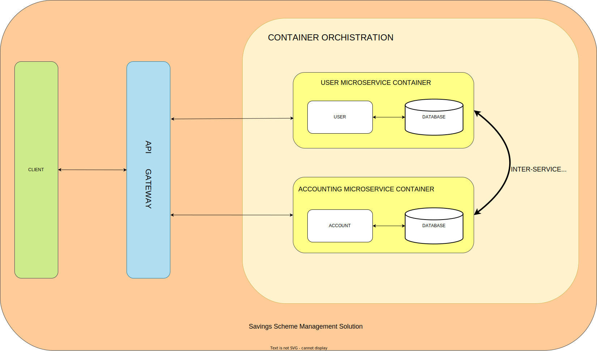

# Savings Scheme Management Solution

My attempt at building a Savings Scheme Management Solution with FastAPI, Docker and PostgreSQL as part of my interview.

## Overview

The system will have 3 components:
- User Microservice
- Accounting Microservice
- Integration API

### User Microservice
The `user` microservice should have the following functionalities:
- Perform basic CRUD operations (create, update, delete and authenticate)
- Create and update a corresponding user on the `accounting` microservice whenever a user is created and updated in the `user` microservice.
- This service should have its own Postgres v13+ database.

### Accounting Microservice
The `accounting` microservice should have the following functionalities:
- Retain account balance and transaction information
- Hold billing plans as follows:
    - Determine whether a savings is a `flat-amount` or a `percentage`
    - Can be assigned to a user
    - Holds accounting rules including:
        - Users have two account balances, `main` and `savings` balance
        - Users can credit their accounts
        - For every credit, the balances are updated according to their savings plan
- If a user has a `flat-amount` billing plan then any amount they credit to their account must be greater than the `flat-amount`.
- Can retrieve transaction logs by date range
- Has its own Postgres v13+ database

### Integration API
This is a frontend API that serves as the main gateway to the system. It should have the following functionalities:
- User Signup
- Select Billing Plan
- Perform credit actions
- Retrieve balance as of a point in time
- List transactions by date range

## Considerations

### Required Toolings and Functionality
- Code must have unit tests with 100% code coverage
- Microservices should be built with docker using .gitlab-ci.yaml CI/CD pipelines
- Inter-service communication should use an asynchronous distributed messaging platform
- Each microservice should follow the database-per-service pattern
- Follow the [Google Python Style Guide](https://google.github.io/styleguide/pyguide.html)

### Extra
- Make [Event Sourcing](https://github.com/pyeventsourcing/eventsourcing) for tracking user balances
- Use SQLAlchemy and AsyncPG to access the database asynchronously